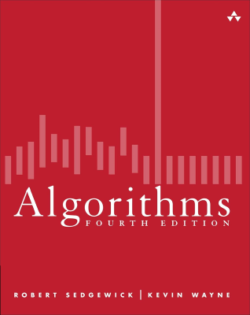

<h1 align="center">Algorithms</h1>

     
    
     

 

    
    
    
    
    

## Resources

- [Algorithms, 4th Edition](https://algs4.cs.princeton.edu/home/)
- [Java SE 17 & JDK 17 API Specification](https://docs.oracle.com/en/java/javase/17/docs/api/index.html)

## Related Projects

- [Introduction to Programming in Java](https://github.com/kserbouty/programming-java)
- [Computer Science](https://github.com/kserbouty/computer-science)

## Roadmap

- [ ] [Chapter 1: Fundamentals](https://algs4.cs.princeton.edu/10fundamentals)
- [ ] [Chapter 2: Sorting](https://algs4.cs.princeton.edu/20sorting)
- [ ] [Chapter 3: Searching](https://algs4.cs.princeton.edu/30searching)
- [ ] [Chapter 4: Graphs](https://algs4.cs.princeton.edu/40graphs)
- [ ] [Chapter 5: Strings](https://algs4.cs.princeton.edu/50strings)
- [ ] [Chapter 6: Context](https://algs4.cs.princeton.edu/60context)

## License

This project is released under the [MIT License](./LICENSE.md).
