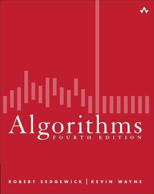

<h1 align="center">Algorithms</h1>

     
    
     

 

    
    
    
    

## About

Ending [Introduction to Programming in Java](https://github.com/kserbouty/programming-java) and [Computer Science](https://github.com/kserbouty/computer-science) with important algorithms and data structures in use today.

## Documentation

### Princeton University

- [Algorithms, 4th Edition](https://algs4.cs.princeton.edu/home/)

### External Links

- [Java® Platform, SE & JDK
  Version 21 API Specification](https://docs.oracle.com/en/java/javase/21/docs/api/index.html)

## Roadmap

- [ ] [Chapter 1: Fundamentals](https://algs4.cs.princeton.edu/10fundamentals)
- [ ] [Chapter 2: Sorting](https://algs4.cs.princeton.edu/20sorting)
- [ ] [Chapter 3: Searching](https://algs4.cs.princeton.edu/30searching)
- [ ] [Chapter 4: Graphs](https://algs4.cs.princeton.edu/40graphs)
- [ ] [Chapter 5: Strings](https://algs4.cs.princeton.edu/50strings)
- [ ] [Chapter 6: Context](https://algs4.cs.princeton.edu/60context)

## License

This project is released under [the MIT License](./LICENSE.md).
